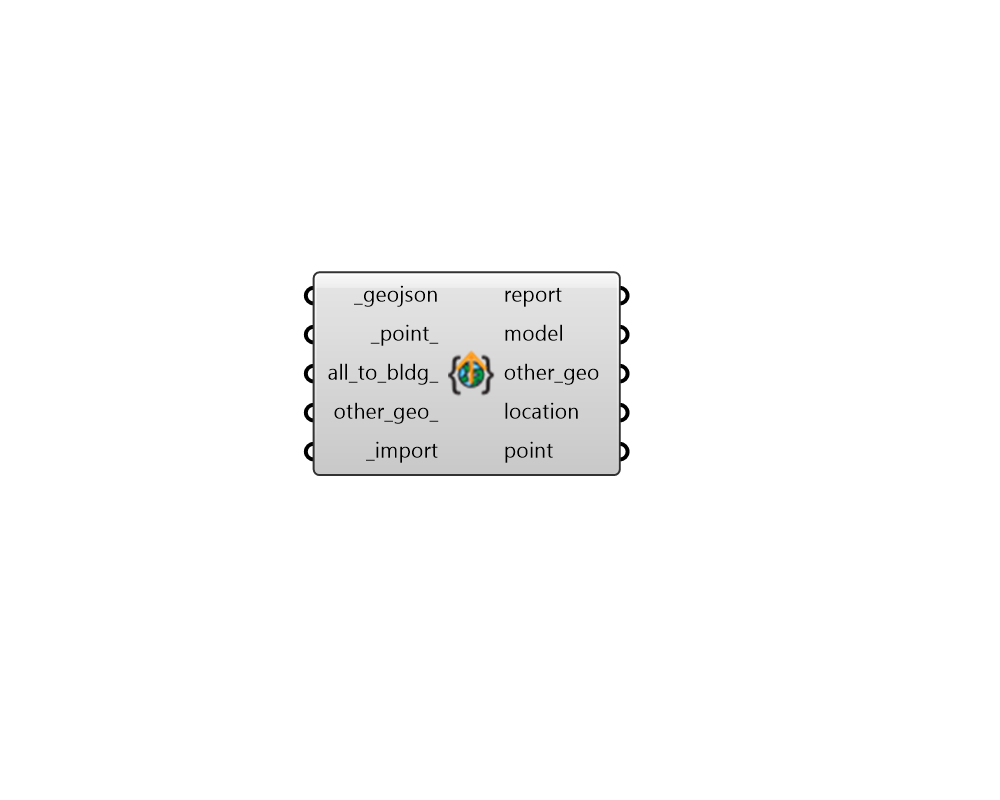

# Model From geoJSON

 - [\[source code\]](https://github.com/ladybug-tools/dragonfly-grasshopper/blob/master/dragonfly_grasshopper/src//DF%20Model%20From%20geoJSON.py)

Create a Dragonfly Model from a geoJSON file.

## Inputs

* **geojson \[Required\]**

  Text for the full path to a geojson file to be loaded as a Dragonfly Model. 

* **point**

  An optional Point for where the bottom-left corner of the bounding rectangle around all of the geoJSON building footprints exists within the Rhino scene. \(Default: \(0, 0\), the Rhino origin\). 

* **all\_to\_bldg**

  Boolean to indicate if all polygon and multi-polygon geometries in the geojson file should be considered Buildings. If False or unspecified, this component will only generate Dragonfly Buildings from geometries that are defined as a 'Building' in the 'type' field of the 'properties' field of each geoJSON feature. Note that this 'type' field is not a universal convention of all geoJSONs. However, all Dragonfly-expored geoJSONs will have it and all URBANopt-compatible geoJSONs will also have it. 

* **other\_geo**

  Boolean to indicate whether geometry that is not identified as a dragonfly Building should be imported. For large geoJSONs, this can potentially increase the component runtime a lot but this geometry may be useful for constructing other important features like context or electical networks. 

* **import \[Required\]**

  Set to "True" to import the geoJSON as a Dragonfly Model. 

## Outputs

* **report**

  Reports, errors, warnings, etc. 

* **model**

  A Dragonfly Model object derived from the input geoJSON. 

* **other\_geo**

  Other non-building line segment and polygon data contained within the geoJSON. Will be None unless other_geo_ is set to True. 

* **location**

  A ladybug Location object possessing longitude and lattiude data used to position geoJSON file on the globe. 

* **point**

  A Point for where the \_location object exists within the space of the Rhino scene. This is can be used to re-position the geoJSON file on the globe when re-exporting the Dragonfly Model to geoJSON. 

