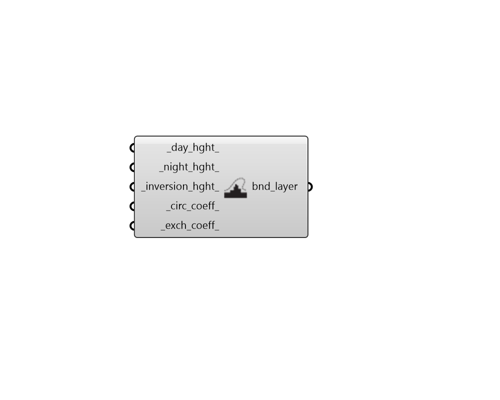

# Boundary Layer Parameters

 - [\[source code\]](https://github.com/ladybug-tools/dragonfly-grasshopper/blob/master/dragonfly_grasshopper/src//DF%20Boundary%20Layer%20Parameters.py)

Create BoundaryLayerParameters representing the properties of the urban boundary layer in an Urban Weather Genrator \(UWG\) simulation.

## Inputs

* **day\_hght**

  A number that represents the height in meters of the urban boundary layer during the daytime. This is the height to which the urban meteorological conditions are stable and representative of the overall urban area. Typically, this boundary layer height increases with the height of the buildings. \(Default: 1000 meters\). 

* **night\_hght**

  A number that represents the height in meters of the urban boundary layer during the nighttime. This is the height to which the urban meteorological conditions are stable and representative of the overall urban area. Typically, this boundary layer height increases with the height of the buildings. \(Default: 80 meters\). 

* **inversion\_hght**

  A number that represents the height in meters at which the vertical profile of potential temperature becomes stable. Can be determined by flying helium balloons equipped with temperature sensors and recording the air temperatures at different heights. \(Default: 150 meters\). 

* **circ\_coeff**

  A number representing the circulation coefficient. \(Default: 1.2, per Bueno \(2012\)\). 

* **exch\_coeff**

  A number representing the exchange coefficient. \(Default: 1.0, per Bueno \(2014\)\). 

## Outputs

* **bnd\_layer**

  Boundary layer parameters that can be plugged into the "DF UWG Simulation Parameter" component to specify the properties of the urban boundary layer. 

