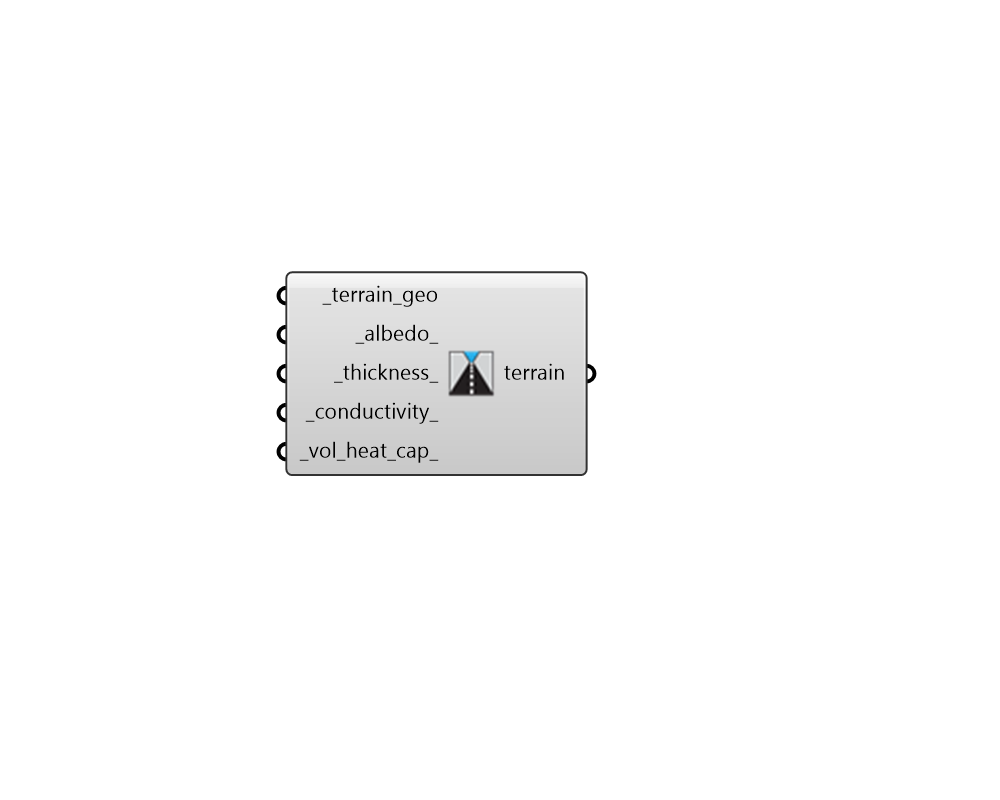

# Terrain

 - [\[source code\]](https://github.com/ladybug-tools/dragonfly-grasshopper/blob/master/dragonfly_grasshopper/src//DF%20Terrain.py)

Create a Terrain object representing the land on which an urban area sits.

This includes both the geometry and the properties of the pavement within the urban area.

## Inputs

* **terrain\_geo \[Required\]**

  An array of Breps or meshes that together represent the terrian. This should include the entire area of the site, including that beneath building footprints. 

* **albedo**

  A number between 0 and 1 that represents the albedo \(reflectivity\) of the pavement. \(Default: 0.1, typical of fresh asphalt\). 

* **thickness**

  A number that represents the thickness of the pavement material in meters. \(Default: 0.5 meters\). 

* **conductivity**

  A number representing the conductivity of the pavement material in W/m-K. \(Default: 1 W/m-K, typical of asphalt\). 

* **vol\_heat\_cap**

  A number representing the volumetric heat capacity of the pavement material in J/m3-K. This is the number of joules needed to raise one cubic meter of the material by 1 degree Kelvin. \(Default: 1.6e6 J/m3-K, typical of asphalt\). 

## Outputs

* **terrain**

  A Terrain object that can be plugged into the "DF Assign Model UWG Properties" component to specify the terrain of an urban area. 

